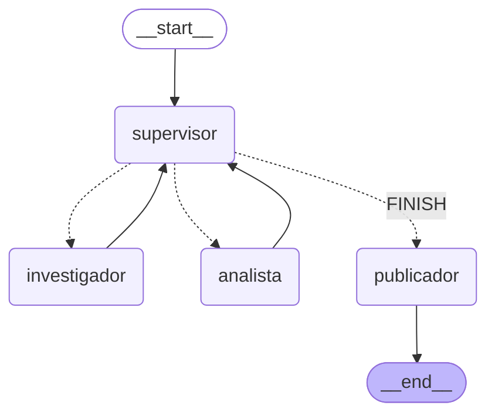
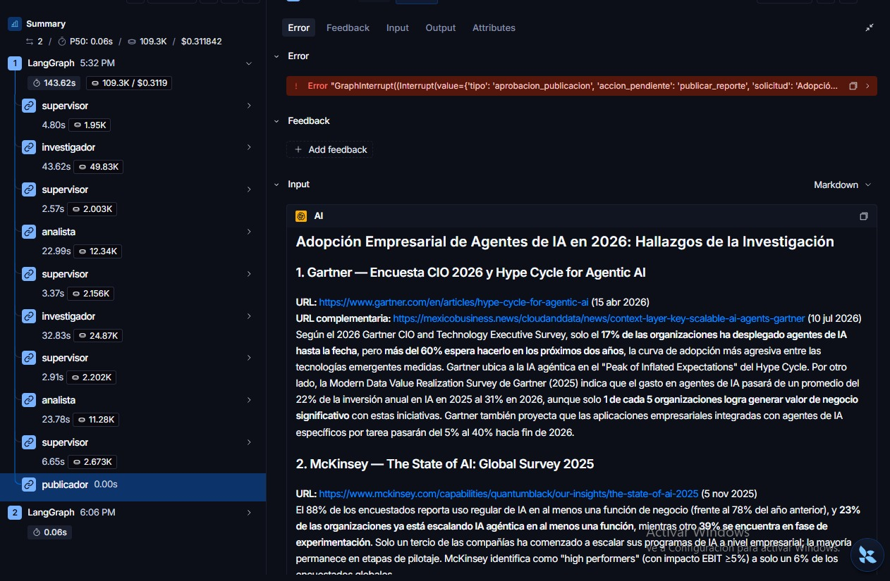
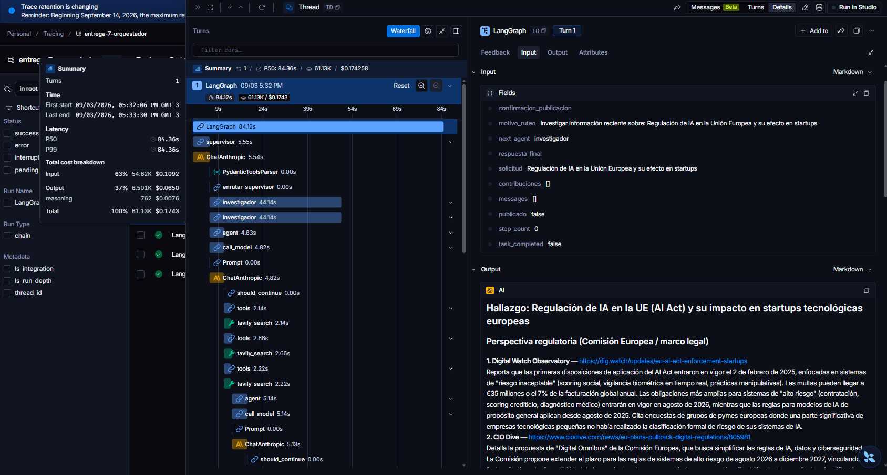
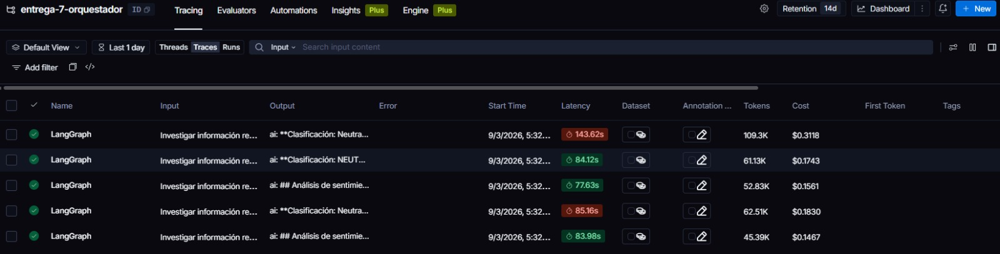
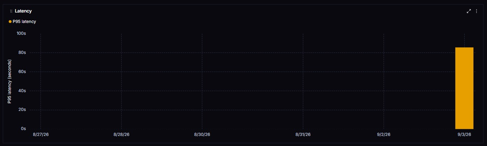
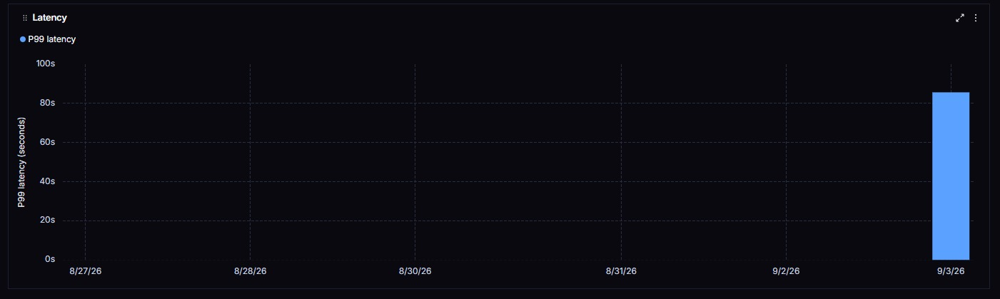

# Pre-entrega 7 — API de producción y monitoreo activo

API REST asíncrona (FastAPI) sobre el orquestador multi-agente jerárquico de la Entrega 6.

---

## Índice

- [Arquitectura](#arquitectura)
- [Puesta en marcha](#puesta-en-marcha)
- [API](#api)
- [Flujo completo de punta a punta](#flujo-completo-de-punta-a-punta)
- [Prueba de carga: 5 peticiones concurrentes](#prueba-de-carga-5-peticiones-concurrentes)
- [Observabilidad y evidencia](#observabilidad-y-evidencia)
- [Decisiones de diseño](#decisiones-de-diseño)
- [Troubleshooting](#troubleshooting)

---

## Arquitectura

### El grafo

Topología que usé en la Entrega 6 (Supervisor + 2 especialistas, con el Supervisor como único
router), más el nodo `publicador` que introduce esta entrega:



El punto de interrupción **no** es la decisión `FINISH` del Supervisor. Cuando el Supervisor da
la investigación por cerrada, el grafo entra en `publicador`, que llama a `interrupt()` y
espera aprobación humana antes de ejecutar `publicar_reporte`. Eso separa dos preguntas
distintas: *¿la investigación está completa?* (la decide el Supervisor con su rúbrica) y
*¿la publicamos?* (la decide una persona).

### La capa de servicio

```
POST /tasks ──► crear_job (PENDING) ──► 202 {job_id}          ← el handler termina acá
                       │
                       └─ BackgroundTask: worker.ejecutar_job
                              │  RUNNING
                              ├─ grafo.ainvoke(estado_inicial, thread_id=job_id)
                              │     supervisor ⇄ investigador ⇄ analista → publicador
                              │                                              │
                              │                                      interrupt(payload)
                              │                                   checkpoint → Redis
                              ├─ AWAITING_APPROVAL  ó  DONE  ó  FAILED
                              ▼
POST /tasks/{id}/approve ──► 202                              ← el handler termina acá
                       │
                       └─ BackgroundTask: worker.reanudar_job
                              Command(resume={"aprobado": ...}) → publicar_reporte → DONE
```

| Módulo | Responsabilidad |
|---|---|
| `app/main.py` | FastAPI: lifespan (checkpointer + cliente Redis + grafo compilado) y los 3 endpoints. |
| `app/worker.py` | Corre el grafo en background y mapea el desenlace al estado del job. **Todo el manejo de errores vive acá.** |
| `app/jobs.py` | Job store en Redis: hash `job:{job_id}` con el ciclo de vida. |
| `app/hitl.py` | Nodo `publicador`: `interrupt()` / resume. |
| `app/observability.py` | Valida al arrancar que LangSmith vaya a producir trazas. |
| `app/graph.py` | Ensambla el grafo y recibe el checkpointer inyectado. |
| `app/{config,state,tools,supervisor}.py`, `app/agents/` | Migrados de la Entrega 6. |

### Los dos stores de Redis

Conviven en la misma instancia con propósitos distintos:

| Keyspace | Quién lo escribe | Para qué |
|---|---|---|
| `job:{job_id}` | `app/jobs.py` | Ciclo de vida visible al cliente: `status`, `solicitud`, `error`, `creado_en`, `actualizado_en`. |
| `checkpoint*` | `AsyncRedisSaver` | Estado interno del grafo: mensajes, contribuciones, interrupción pendiente. |

**`thread_id == job_id`**: un único identificador para "el trabajo" y "el hilo". Por eso
`GET /tasks/{job_id}` lee el ciclo de vida del hash y el *contenido* (respuesta final,
publicación, aprobación pendiente) directamente del checkpointer con `aget_state()`, sin
duplicar el resultado en dos lugares que puedan divergir.

---

## Puesta en marcha

### 1. Variables de entorno

```bash
cp .env.example .env
```

Completá `ANTHROPIC_API_KEY`, `TAVILY_API_KEY` y `LANGCHAIN_API_KEY`
(esta última desde https://smith.langchain.com/settings).

### 2a. Todo en Docker (recomendado)

```bash
docker compose up --build
```

Levanta `redis:8-alpine` y la API en `http://localhost:8000`. El servicio `api` pisa
`REDIS_URL` con `redis://redis:6379`, así que el mismo `.env` sirve adentro y afuera del
contenedor.

> **Tiene que ser Redis 8+.** El checkpointer usa RedisJSON y RediSearch, que Redis 8 trae de
> fábrica. Con `redis:alpine` a secas, `asetup()` falla al crear los índices.

### 2b. Redis en Docker, API local

Más cómodo para iterar:

```bash
docker compose up -d redis

python -m venv .venv
.venv\Scripts\activate          # Windows;  source .venv/bin/activate en Linux/macOS
pip install -r requirements.txt

uvicorn app.main:app --reload
```

### 3. Verificar que arrancó

```bash
curl http://localhost:8000/health
# {"status":"ok","redis":"ok","proyecto":"entrega-7-orquestador"}
```

En el log del arranque tienen que aparecer las tres líneas:

```
Observabilidad activa: trazas hacia LangSmith en el proyecto 'entrega-7-orquestador'.
Checkpointer de LangGraph listo en redis://...
Grafo compilado con checkpointer. API lista.
```

Los índices del checkpointer quedan creados:

```bash
docker exec entrega7-redis redis-cli FT._LIST
```

Documentación interactiva en `http://localhost:8000/docs`.

---

## API

### `POST /tasks` → `202 Accepted`

Encola una investigación. Lo único que pasa dentro del handler es un `HSET`; el grafo
(minutos de LLM y búsquedas) corre en un `BackgroundTask`.

```jsonc
// request
{ "solicitud": "Adopción empresarial de agentes de IA en 2026" }

// response
{ "job_id": "3f2a...", "status": "PENDING", "solicitud": "Adopción empresarial..." }
```

### `GET /tasks/{job_id}`

```jsonc
{
  "job_id": "3f2a...",
  "status": "AWAITING_APPROVAL",     // PENDING | RUNNING | AWAITING_APPROVAL | DONE | FAILED
  "solicitud": "...",
  "error": "",
  "creado_en": "2026-09-03T20:05:52+00:00",
  "actualizado_en": "2026-09-03T20:08:11+00:00",
  "respuesta_final": "Síntesis del Supervisor...",
  "publicado": false,
  "confirmacion_publicacion": "",
  "aprobacion_pendiente": {          // sólo mientras está en AWAITING_APPROVAL
    "tipo": "aprobacion_publicacion",
    "accion_pendiente": "publicar_reporte",
    "solicitud": "...",
    "respuesta_final": "...",
    "pasos_supervisor": 4,
    "contribuciones": [{ "agente": "investigador", "paso": 1, "resumen": "..." }],
    "instrucciones": "Revisá 'respuesta_final' y respondé con POST /tasks/{job_id}/approve ..."
  }
}
```

`404` si el `job_id` no existe.

### `POST /tasks/{job_id}/approve` → `202 Accepted`

```jsonc
{ "aprobado": true, "revisor": "zoel", "comentario": "" }
```

- `404` si el job no existe.
- `409` si el job no está en `AWAITING_APPROVAL`.
- Con `aprobado: true` se ejecuta `publicar_reporte` y el job pasa a `DONE` con
  `publicado: true`.
- Con `aprobado: false` el job **también** pasa a `DONE`, con `publicado: false` y el motivo
  en `confirmacion_publicacion`. Rechazar no es fallar.

El `Command(resume=...)` **no** corre dentro del handler: se encola como `BackgroundTask`,
igual que `POST /tasks`.

---

## Flujo completo de punta a punta

> **No hace falta un payload especial para disparar el Human-in-the-loop.** En esta arquitectura
> **toda** solicitud pausa: cuando el Supervisor da la investigación por cerrada, el grafo entra
> al nodo `publicador`, que llama a `interrupt()` **antes** de ejecutar la única acción con
> efecto secundario (`publicar_reporte`). Publicar un reporte es en sí misma la acción crítica —
> irreversible una vez hecha y con costo asociado — así que no hay "tareas críticas" y "tareas
> normales" a distinguir: cualquier `POST /tasks` termina en `AWAITING_APPROVAL` y requiere un
> `POST /tasks/{id}/approve` para completarse.

```bash
# 1. Encolar (responde en milisegundos)
curl -s -X POST http://localhost:8000/tasks \
  -H "Content-Type: application/json" \
  -d '{"solicitud":"Adopción empresarial de agentes de IA en 2026"}'
# {"job_id":"3f2a...","status":"PENDING",...}

JOB=3f2a...

# 2. Polling hasta AWAITING_APPROVAL (uno o dos minutos)
curl -s http://localhost:8000/tasks/$JOB

# El hash de Redis, en crudo:
docker exec entrega7-redis redis-cli HGETALL job:$JOB

# 3. Aprobar
curl -s -X POST http://localhost:8000/tasks/$JOB/approve \
  -H "Content-Type: application/json" \
  -d '{"aprobado":true,"revisor":"zoel"}'

# 4. Estado final
curl -s http://localhost:8000/tasks/$JOB
# "status":"DONE", "publicado":true,
# "confirmacion_publicacion":"Reporte 0df1d5aa publicado el 2026-... (aprobado por: zoel)."
```

**Camino de rechazo** (otro job): `-d '{"aprobado":false,"revisor":"zoel","comentario":"fuentes flojas"}'`
→ `DONE` con `publicado: false`.

**Camino de error**: arrancá la API con una `ANTHROPIC_API_KEY` inválida y encolá una tarea.
El job pasa a `FAILED` con el mensaje en `error` — nunca queda colgado en `RUNNING`.

**Aprobar un job que no está pausado** → `409`.

---

## Prueba de carga: 5 peticiones concurrentes

Con la API arriba:

```bash
python scripts/load_test.py
```

```
Disparando 5 peticiones concurrentes contra http://localhost:8000

  [202] 3f2a...  Adopción empresarial de agentes de IA en 2026
  [202] 8b1c...  Estado del mercado de chips para inferencia en 2026
  [202] c47d...  Impacto de los modelos open-weight en el mercado cloud
  [202] 1e90...  Regulación de IA en la Unión Europea y su efecto en startups
  [202] a55f...  Tendencias de inversión en infraestructura de IA en Latinoamérica

Batch completo en 38 ms (encolado, no ejecución).
```

Que las 5 se acepten en decenas de milisegundos **es** la prueba de que el event loop no se
bloquea: cada una de esas investigaciones tarda minutos, y ninguna se ejecutó todavía. Las 5
corren después en paralelo como background tasks, cada una con su propio `thread_id`.

Seguimiento con `GET /tasks/{job_id}` (los 5 IDs quedan impresos) y en el dashboard de
LangSmith.

Si la API corre en otro host o puerto: `API_URL=http://otro-host:8000 python scripts/load_test.py`.

---

## Observabilidad y evidencia

La instrumentación es automática vía variables de entorno — LangChain y LangGraph reportan
solos cada `ainvoke`, cada llamada al LLM y cada tool call. `app/observability.py` no
instrumenta nada a mano; sólo valida al arrancar que la configuración vaya a producir trazas,
y **falla ruidosamente** si `LANGCHAIN_TRACING_V2=true` pero falta la API key (el síntoma
natural — un dashboard vacío — recién se descubre después de haber gastado tokens).

Dashboard: https://smith.langchain.com → proyecto `entrega-7-orquestador`.

### Capturas en `/screenshots`

| Archivo | Qué muestra |
|---|---|
| `Entrega7_Nodes_interrupt.png` | El árbol de nodos de una ejecución completa (`supervisor` ⇄ `investigador` ⇄ `analista` → `publicador`) con el `GraphInterrupt` y su payload de aprobación. |
| `Entrega7_Trace_Details.png` | Vista de detalle de una traza individual: costo desglosado por tipo de token (input/output/reasoning), latencia e input/output completos de esa ejecución. |
| `Entrega7_costs_per_run_and_latency.jpeg` | Las 5 ejecuciones concurrentes con **costo y latencia por ejecución**, tokens y estado. |
| `Entrega7_Latency_P95.png` | Chart de **latencia p95** del dashboard. |
| `Entrega7_Latency_P99.png` | Chart de latencia p99, como contraste. |



Sobre esta captura: la pestaña **Error** de esa trace muestra un `GraphInterrupt`. **No es un
fallo** — es el mecanismo de `interrupt()`: LangGraph pausa el grafo levantando esa excepción, la
captura el runtime y persiste el checkpoint. La run figura como `success` y el job queda en
`AWAITING_APPROVAL`. Se ve también el nodo `publicador` en `0.00s` (interrumpió sin llegar a
publicar) y, debajo, la segunda trace del resume tras la aprobación, que sí ejecuta
`publicar_reporte`.









### Resultados de la corrida

Corrida del 2026-09-03, 5 peticiones concurrentes vía `scripts/load_test.py`.

| Métrica | Valor |
|---|---|
| Latencias por ejecución, ordenadas (s) | `77.6`, `84.0`, `84.1`, `85.2`, `143.6` |
| p50 (s) | `84.1` |
| **p95 (s)** | **`131.9`** &nbsp;← `85.2 + 0.8 × (143.6 − 85.2)` |
| p99 (s) | `141.3` |
| máximo (s) | `143.6` |
| **Costo por ejecución (USD)** | **`$0.1944`** |
| Costo total de la corrida (USD) | `$0.9719` |
| Tokens totales | `331.159` |

Latencia y costo salen de las 5 *root runs* del proyecto en LangSmith. Como los charts del
dashboard no ofrecen p95, los percentiles se calculan sobre esas 5 muestras con interpolación
lineal (`índice = p × (n−1)`), reproducible con:

```python
from langsmith import Client
runs = list(Client().list_runs(project_name="entrega-7-orquestador", is_root=True))
lat = sorted((r.end_time - r.start_time).total_seconds() for r in runs)
i = 0.95 * (len(lat) - 1); lo = int(i)
p95 = lat[lo] + (i - lo) * (lat[lo + 1] - lat[lo])
```

**Contraste independiente:** los timestamps del job store (`creado_en` → `actualizado_en` del
hash `job:{job_id}`, capturados al alcanzar `AWAITING_APPROVAL`) dan
`78.9 / 84.0 / 85.4 / 86.5 / 144.9` s y **p95 = 133.2 s**. La diferencia de ~1 s por job contra
LangSmith es el overhead de encolado: Redis cronometra desde el `HSET` del handler, LangSmith
desde el arranque del grafo en el background task.

```bash
docker exec entrega7-redis redis-cli --scan --pattern 'job:*'   | xargs -I{} docker exec entrega7-redis redis-cli HMGET {} creado_en actualizado_en status
```

> **Ojo al armar el chart de latencia: filtralo a root runs.** Estas 5 ejecuciones generaron
> **353 runs** en el proyecto (258 `chain`, 45 `llm`, 33 `tool`, 17 `parser`): cada trace se
> descompone en spans anidados, y un chart sin filtrar los cuenta a todos como si fueran
> ejecuciones. El percentil sale del conjunto equivocado — p99 sobre las 353 da `80.7 s`,
> contra `141.3 s` sobre las 5 traces reales. En **Filter & group** del chart, filtrá por
> *root runs* antes de capturar.
>
> Si ese filtro no toma efecto, usá **`Name` `is` `LangGraph`**: es el nombre de la run raíz del
> grafo y ninguna run hija lo comparte (las hijas se llaman `supervisor`, `investigador`,
> `ChatAnthropic`, `tavily_search`, etc.), así que selecciona exactamente las 5 ejecuciones.
> Para verificar que el filtro entró, el chart tiene que estar contando 5 runs y no 353.
>
> **Y acotá el rango temporal del dashboard a la ventana de la prueba de carga.** Cada
> aprobación o rechazo reanuda el grafo, y ese resume genera *otra* run raíz llamada
> `LangGraph` de ~0.1 s (el nodo `publicador` no llama a ningún LLM). Con dos aprobaciones ya
> hechas, el filtro por nombre pasa a contar 7 runs y el p95 cae de `131.9 s` a `126.1 s`. El
> rango temporal es lo que separa las 5 ejecuciones concurrentes de los resume posteriores.

### Lectura del dashboard: dónde se va el tiempo y los tokens

Desglose por nodo del grafo, agregando los 34 nodos ejecutados en las 5 traces:

| Nodo | Invocaciones | Latencia total | % latencia | Latencia/inv. | Tokens | % tokens |
|---|---:|---:|---:|---:|---:|---:|
| `investigador` | 6 | 247.5 s | 52.2 % | 41.2 s | 219.147 | **66.2 %** |
| `analista` | 6 | 142.0 s | 30.0 % | 23.7 s | 74.878 | 22.6 % |
| `supervisor` | 17 | 84.5 s | 17.8 % | 5.0 s | 37.134 | 11.2 % |
| `publicador` | 5 | 0.0 s | 0.0 % | 0.0 s | 0 | 0.0 % |
| **Total** | **34** | **474.0 s** | 100 % | | **331.159** | 100 % |

Cuatro lecturas:

1. **El `investigador` es el nodo caro**: dos tercios de los tokens y la mitad de la latencia,
   con 41.2 s por invocación. Pero `tavily_search` sólo acumula 87.9 s en 27 llamadas — el
   18.6 % del tiempo de nodos. O sea que el costo del investigador **no es la búsqueda**, es el
   LLM procesando los resultados de Tavily y redactando el hallazgo con las citas.
2. **El `supervisor` es barato pese a ser el más invocado**: 17 ejecuciones, 11.2 % de los
   tokens, 5 s cada una. Es la anti-contaminación de contexto de la Entrega 6 rindiendo — el
   Supervisor sólo ve `solicitud` + los `resumen` de cada contribución
   (`_digest_contribuciones`), nunca el `messages` completo ni los `detalle`.
3. **`investigador` y `analista` corrieron 6 veces sobre 5 traces**: una tarea necesitó una
   segunda ronda porque el Analista devolvió `FUENTES INSUFICIENTES` y el Supervisor lo
   reruteó (regla 4 de la rúbrica). Es la trace de 143.6 s, y se ve en
   `Entrega7_Nodes_interrupt.png`: el ciclo `investigador → analista → investigador → analista`.
   Esa sola ronda extra explica la diferencia entre el p50 (84 s) y el p95 (131.9 s) — **la cola
   de latencia es el reruteo del Supervisor, no la concurrencia ni la infraestructura**.
4. **El `publicador` no consume nada**: 0 tokens, 0.0 s. No llama a ningún LLM; sólo arma el
   payload e interrumpe. El costo del HITL es cero.

Reproducible con la API de LangSmith contando **sólo los hijos directos de la run raíz** — los
sub-agentes ReAct se registran con el mismo `name` que su nodo (`create_react_agent(...,
name="investigador")`), así que filtrar por nombre a secas duplica latencia y tokens.

---

## Decisiones de diseño

**BackgroundTasks, no Celery.** La consigna pide que la API no bloquee, no que haya un broker.
`BackgroundTasks` corre la tarea en el mismo proceso después de emitir la respuesta, que es
exactamente el alcance pedido. El precio, explícito: si el proceso muere, los jobs en vuelo
quedan en `RUNNING`. Como el checkpoint sí está en Redis, un rearranque puede reanudar el
`thread_id` — pero ese barrido no está implementado, está fuera de alcance.

**Un solo `interrupt()`, después de FINISH.** Ver [Arquitectura](#arquitectura).

**El efecto secundario se ejecuta exactamente una vez.** LangGraph reanuda **re-ejecutando el
nodo entero desde el principio**, no desde la línea del `interrupt()`. Por eso en
`hitl.nodo_publicador` todo lo previo al `interrupt()` es puro (armar el payload) y la única
línea con efecto secundario va estrictamente después.

**`publicar_reporte` no es una `@tool`.** Ningún agente LLM puede elegir invocarla: la ejecuta
el nodo, y sólo con aprobación humana. Es un efecto secundario simulado (registro en memoria +
log), `async` para que la firma no cambie el día que apunte a un destino real.

**El error handling del worker no es opcional.** `_correr_grafo` captura `Exception` (no
`BaseException`, para que un `CancelledError` de shutdown siga propagándose), loguea con
traceback y persiste `FAILED` con el mensaje. Si además se cayó Redis, el fallo queda al menos
en el log del proceso. Ningún camino deja un job en `RUNNING` para siempre.

**`GET` lee el resultado del checkpointer.** El hash de job guarda sólo el ciclo de vida; el
contenido sale de `aget_state()`. Una sola fuente de verdad para cada cosa.

**`/health` no está en la consigna.** Son tres líneas y hace un `PING` real contra Redis: sirve
para verificar el arranque antes de gastar una corrida. Se puede borrar sin tocar nada más.

---

## Troubleshooting

**`asetup()` falla con un error de índice / comando desconocido.**
Redis no es 8+. `redis:alpine` a secas no trae RedisJSON ni RediSearch. Usá `redis:8-alpine`
(ya está en el `docker-compose.yml`) y verificá con `docker exec entrega7-redis redis-cli MODULE LIST`.

**El dashboard de LangSmith muestra costo $0.**
Las trazas llegan pero el modelo configurado en `ANTHROPIC_MODEL` no está en la tabla de
precios de LangSmith. Cargá el precio del modelo en **Settings → Models** y el costo se
recalcula.

**No aparece ninguna traza.**
El log de arranque tiene que decir `Observabilidad activa: ...`. Si dice el warning de
`LANGCHAIN_TRACING_V2`, la variable no está en `true`. Ojo también: el SDK de LangSmith
resuelve cada variable buscando primero `LANGSMITH_*` y después `LANGCHAIN_*`, así que un
`LANGSMITH_API_KEY` viejo en la máquina le gana al `LANGCHAIN_API_KEY` del `.env`.

**La API no conecta con Redis.**
Corriendo con `uvicorn` local, `REDIS_URL` tiene que ser `redis://localhost:6379`; dentro de
compose, `redis://redis:6379` (el servicio `api` ya lo pisa). Chequealo con `GET /health`.

**Un job queda en `PENDING` para siempre.**
`PENDING` sólo dura hasta que arranca el background task. Si no se mueve, la API murió entre
el `HSET` y el arranque de la tarea; revisá el log del proceso.

**`409` al aprobar.**
El job no está en `AWAITING_APPROVAL`. Consultá `GET /tasks/{job_id}`: si está en `RUNNING`
todavía está investigando; si está en `DONE` ya se aprobó o se rechazó.
